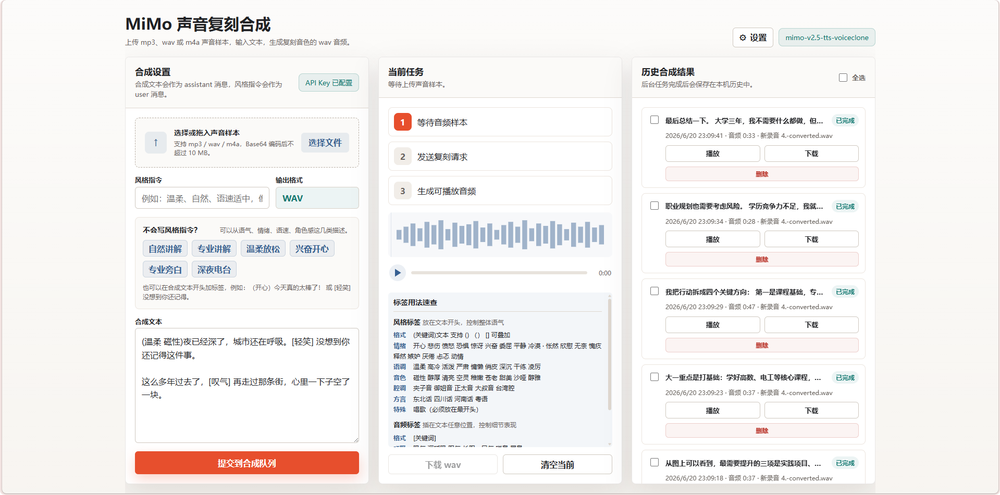

# MiMo Voice Cloning Synthesis Tool

[中文文档](README_zh.md)

A local web application for voice cloning and speech synthesis, powered by the [Xiaomi MiMo](https://platform.xiaomimimo.com/) `mimo-v2.5-tts-voiceclone` model. Upload a voice sample, enter text, and generate natural-sounding speech in a cloned voice — all from your browser.



## Features

- **Voice Cloning** — Upload an mp3/wav/m4a voice sample and generate speech that mimics the original voice
- **Style Control** — Fine-tune output with natural language style prompts and inline audio tags (emotions, tone, speed, dialect, etc.)
- **Background Task Queue** — Submit multiple synthesis jobs; they run sequentially in the background while you keep working
- **Waveform Player** — Custom audio player with real-time Canvas waveform visualization and scrubbing
- **Persistent History** — All synthesis results are saved locally as WAV files with metadata, ready to play, download, or delete
- **Browser Notifications** — Get notified when a synthesis job completes or fails
- **Batch Management** — Select and delete multiple history entries at once
- **API Key Security** — The API key is stored server-side only; the frontend never sees the raw key

## Prerequisites

- **Java 17+**
- **Maven 3.6+**
- A Xiaomi MiMo API Key — get one at [platform.xiaomimimo.com](https://platform.xiaomimimo.com/)

## Quick Start

```bash
git clone https://github.com/TTanDev/Voice-cloning-synthesis.git
cd Voice-cloning-synthesis
mvn spring-boot:run
```

Open [http://localhost:8080/](http://localhost:8080/) in your browser.

## Usage

1. Click **Settings** (top-right) and enter your MiMo API Key. The default API Base URL is `https://api.xiaomimimo.com/v1`.
2. Upload a voice sample (mp3, wav, or m4a — max ~10 MB after Base64 encoding).
3. (Optional) Enter a **style prompt** — e.g., "gentle, natural, moderate pace" — or pick one of the presets.
4. Enter the **synthesis text**. You can embed style tags like `(happy)Today is amazing!` and audio tags like `[sigh]` for fine-grained control.
5. Click **Submit to Synthesis Queue**. The job runs in the background; you can keep submitting more while it processes.
6. Once complete, play, download, or manage results in the **History** panel.

### Style & Audio Tags

The MiMo model supports rich in-text control:

- **Style tags** at the start of text: `(happy)text`, `(gentle magnetic)text`, `(Cantonese)text`
- **Audio tags** anywhere in text: `[sigh]`, `[chuckle]`, `[trembling]`, `[deep breath]`

See the in-app tag reference guide or [mimo-tts-api-doc.md](mimo-tts-api-doc.md) for the full list.

## Project Structure

```
├── pom.xml                               # Maven configuration
├── src/main/java/com/voiceclone/
│   ├── MimoVoiceCloneApplication.java    # Spring Boot entry point
│   ├── api/
│   │   ├── SynthesisController.java      # Synthesis REST endpoints
│   │   ├── SettingsController.java       # Settings REST endpoints
│   │   ├── ApiException.java             # Custom exception
│   │   └── ApiExceptionHandler.java      # Global exception handler
│   ├── config/
│   │   ├── MimoSettings.java             # Settings model
│   │   └── SettingsService.java          # Settings persistence
│   └── service/
│       ├── MimoVoiceCloneService.java    # MiMo API client
│       └── SynthesisJobService.java      # Async job queue & persistence
└── src/main/resources/
    ├── application.properties            # App configuration
    └── static/
        ├── index.html                    # Frontend page
        ├── app.js                        # Frontend logic
        └── styles.css                    # Styles
```

## Tech Stack

| Layer | Technology |
|-------|-----------|
| Backend | Spring Boot 3.3.7, Java 17 |
| Frontend | Vanilla HTML/CSS/JS (no framework) |
| Build | Maven |
| Storage | File system (JSON + WAV) |
| External API | Xiaomi MiMo TTS (`mimo-v2.5-tts-voiceclone`) |

## API Documentation Note

The file `mimo-tts-api-doc.md` is a Markdown adaptation of the official Xiaomi MiMo TTS API reference documentation. The official documentation does not provide a Markdown version, so this file was manually compiled from the [official reference](https://mimo.mi.com/#/docs) on **June 20, 2026 (~20:00 CST)**. It may not reflect the latest API changes. For the most up-to-date information, please refer to the [official MiMo documentation](https://mimo.mi.com/).

## Data Privacy

All data is stored locally in the `.mimo-voiceclone/` directory within the project folder:

- `settings.json` — API Key and Base URL
- `history/` — Synthesis results (JSON metadata + WAV audio)
- `voice-queue/` — Temporary voice samples for pending jobs (auto-cleaned)

The `.mimo-voiceclone/` directory is included in `.gitignore` and will **never** be committed to the repository.

## License

[MIT License](LICENSE)

## Acknowledgements

- Voice synthesis powered by [Xiaomi MiMo](https://platform.xiaomimimo.com/) — thank you for providing the TTS API.
