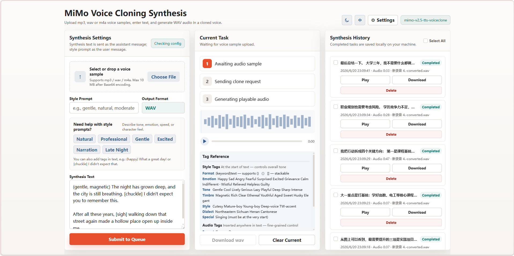

# MiMo 声音克隆合成工具

> 🎤 上传一段声音样本，输入文字 —— 即可生成克隆声音的语音。

[English](README.md)



---

基于[小米 MiMo](https://platform.xiaomimimo.com/) `mimo-v2.5-tts-voiceclone` 模型的本地语音合成 Web 应用。免 GPU、免 Python 依赖、免 Docker —— 克隆一个声音，在浏览器里直接生成语音。

---

## ⚡ 快速开始

```bash
git clone https://github.com/TTanDev/Voice-cloning-synthesis.git
cd Voice-cloning-synthesis
mvn spring-boot:run
```

→ 浏览器打开 [http://localhost:8080](http://localhost:8080)

**前置要求：** Java 17+ · Maven 3.6+ · [MiMo API Key](https://platform.xiaomimimo.com/)

---

## ✨ 产品特色

### 🎤 克隆任意声音
上传 mp3/wav/m4a 声音样本（约 10 MB 以内），模型自动学习声音特征。无需训练、无需微调，一次上传即可使用。

### 🎭 丰富的表现力控制
告别平淡的机器音：

| 控制方式 | 示例 | 效果 |
|---------|------|------|
| 风格描述 | `温柔、自然、中等语速` | 为整段输出设定整体基调 |
| 风格标签 | `(happy)今天真开心！` | 对后续文字施加情绪影响 |
| 音效标签 | `我很好 [sigh]` | 插入非语言声音（笑声、叹气、呼吸...） |

支持的风格：happy、sad、angry、gentle、magnetic、Cantonese 等  
支持的音效：`[sigh]` · `[chuckle]` · `[trembling]` · `[deep breath]`

→ 完整标签参考：[mimo-tts-api-doc.md](mimo-tts-api-doc.md)

### ⏱️ 队列合成，切走不管
支持同时提交多个合成任务，后台依次执行，不阻塞界面。每个任务完成时自动弹出浏览器通知。

### 🎧 波形播放器
内置音频播放器，带实时 Canvas 波形可视化。拖动进度条，随意预览任意片段，支持 WAV 下载。

### 📜 持久化历史记录
每次合成结果都保存到本地，附带完整元数据。回放、下载、批量管理历史记录 —— 关掉浏览器也不会丢。

### 🏠 本地优先
所有数据都留在你的项目目录（`.mimo-voiceclone/`），除了调用 MiMo API 的必要请求外，没有任何数据外传。

---

## 📖 使用说明

1. **配置** → 点击右上角 Settings → 粘贴 MiMo API Key
2. **上传** → 拖入声音样本（mp3/wav/m4a）
3. **风格**（可选）→ 输入风格描述或选择预设
4. **合成** → 输入文字（可嵌入标签），点击提交
5. **管理** → 在 History 面板回放、下载或整理结果

---

## 🏗️ 项目结构

```
├── pom.xml                               # Maven 配置
├── src/main/java/com/voiceclone/
│   ├── MimoVoiceCloneApplication.java    # Spring Boot 入口
│   ├── api/
│   │   ├── SynthesisController.java      # 合成 REST 接口
│   │   ├── SettingsController.java       # 设置 REST 接口
│   │   ├── ApiException.java             # 自定义异常
│   │   └── ApiExceptionHandler.java      # 全局异常处理
│   ├── config/
│   │   ├── MimoSettings.java             # 设置数据模型
│   │   └── SettingsService.java          # 设置持久化
│   └── service/
│       ├── MimoVoiceCloneService.java    # MiMo API 客户端
│       └── SynthesisJobService.java      # 异步任务队列 & 持久化
└── src/main/resources/
    ├── application.properties            # 应用配置
    └── static/
        ├── index.html                    # 前端页面
        ├── app.js                        # 前端逻辑
        └── styles.css                    # 样式表
```

---

## 🛠️ 技术栈

| 层 | 技术 |
|---|---|
| 后端 | Spring Boot 3.3.7, Java 17 |
| 前端 | 原生 HTML/CSS/JS（无框架） |
| 构建 | Maven |
| 存储 | 本地文件系统（JSON + WAV） |
| 外部 API | 小米 MiMo TTS（`mimo-v2.5-tts-voiceclone`） |

---

## 📋 API 文档说明

`mimo-tts-api-doc.md` 是小米 MiMo TTS API 官方文档的 Markdown 版本。官方未提供 Markdown 格式，此文件于 **2026 年 6 月 20 日（约 20:00 CST）** 根据[官方文档](https://mimo.mi.com/#/docs)手动整理。可能未同步最新变更，请以[官方 MiMo 文档](https://mimo.mi.com/)为准。

---

## 🔒 数据存储

所有数据存储在本地 `.mimo-voiceclone/` 目录：

| 文件/目录 | 内容 |
|----------|------|
| `settings.json` | API Key 和 Base URL |
| `history/` | 合成结果（JSON 元数据 + WAV 音频） |
| `voice-queue/` | 待处理任务的临时声音样本（自动清理） |

该目录已加入 `.gitignore`，**永远不会**被提交到仓库。

---

## 📄 许可证

[MIT License](LICENSE)

---

## 🙏 致谢

语音合成由[小米 MiMo](https://platform.xiaomimimo.com/) 提供 —— 感谢 MiMo 团队的 TTS API。
